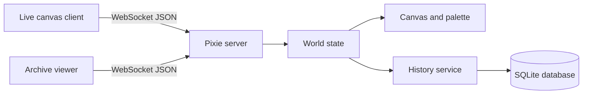

# Pixie

> A persistent, real-time pixel canvas with an event-sourced archive.

Pixie is a small collaborative canvas server built in Rust. Clients connect over WebSocket, paint together on a shared board, and receive updates as they happen. Every change is recorded in SQLite, allowing the included archive client to scrub through the canvas history with snapshot-assisted replay.

The project includes two browser clients:

- **Live canvas** - paint, pan, zoom, choose colors, download the board, and watch other clients work.
- **Archive viewer** - browse event history, move through snapshots, and play the canvas timeline back.

## Highlights

| Capability | What Pixie provides |
| --- | --- |
| Real-time collaboration | WebSocket connections with broadcast pixel updates |
| Durable state | SQLite event log with WAL mode and background writes |
| Fast reconstruction | Periodic canvas snapshots plus event replay |
| History browsing | Forward, backward, or full lookahead chunks for timeline clients |
| Admin controls | Authenticated resize and destructive rollback operations |
| Resilient clients | Full board initialization on connect and after structural changes |
| Lightweight deployment | A single Rust binary or Docker image |

## How It Fits Together



The server starts on `0.0.0.0:8080`. A newly connected client receives an `init` message containing the current dimensions, palette, and board. Paint operations are validated, applied to memory, recorded to history, and broadcast to every connected client.

## Quick Start

### 1. Configure the server

Copy the example environment file and set an admin token:

```bash
copy .env.example .env
```

On macOS or Linux, use `cp .env.example .env` instead. Edit `.env` and replace `change-me` with a private value.

### 2. Run with Cargo

Rust edition 2024 and a current stable Rust toolchain are required.

```bash
cargo run
```

The server listens at `ws://127.0.0.1:8080` when accessed locally. The default database path is `place.db`; set `DATABASE_PATH` to place it elsewhere.

### 3. Open a client

The HTML clients are static files and are not served by the Rust process. Open one of these files in a browser, or serve the repository with any static file server:

- `clients/client.html` - live collaborative canvas
- `clients/archive.html` - history viewer

The included live client is configured for the public endpoint `wss://pixels.terosu.com`. For local development, change its `WS_URL` constant to `ws://127.0.0.1:8080`. The archive client already targets the local server.

For example, with Python installed:

```bash
python -m http.server 8000 --directory clients
```

Then open `http://127.0.0.1:8000/client.html` or `http://127.0.0.1:8000/archive.html`.

## Docker

Create `.env` as described above, then start the service:

```bash
docker compose up --build
```

The compose setup exposes port `8080` and stores the database in the named `pixie_data` volume when `DATABASE_PATH=/data/place.db` is used.

To stop the service:

```bash
docker compose down
```

## Configuration

All settings are read once at startup from `.env` or the process environment.

| Variable | Default | Description |
| --- | --- | --- |
| `ADMIN_TOKEN` | required | Token used with `?auth=...` to identify admin clients |
| `DEFAULT_CANVAS_WIDTH` | `128` | Width of a new canvas |
| `DEFAULT_CANVAS_HEIGHT` | `128` | Height of a new canvas |
| `DEFAULT_SNAPSHOT_INTERVAL` | `100` | Snapshot interval in recorded events |
| `RATE_LIMIT_TOKENS` | `5` | Initial and maximum paint tokens per client |
| `RATE_LIMIT_REFILL_RATE_MS` | `200` | Milliseconds required to refill one paint token |
| `DATABASE_PATH` | `place.db` | SQLite database path |

Non-admin clients are rate-limited independently. Admin clients bypass the paint limiter but still use the same validated message format.

## WebSocket Protocol

Connect to `ws://host:8080` or `wss://host:8080` through a TLS-terminating proxy. To connect as an admin, include the configured token in the handshake query string:

```text
ws://127.0.0.1:8080/?auth=your-admin-token
```

### Client to server

Paint a pixel:

```json
{"type":"paint","x":64,"y":64,"color":"#FF5733"}
```

Request the connected-client count:

```json
{"type":"ping"}
```

Resize the canvas. Admin only:

```json
{"type":"resize","width":256,"height":256,"anchor":"Center"}
```

Valid anchors are `TopLeft`, `TopRight`, `BottomLeft`, `BottomRight`, and `Center`.

Rollback history. Admin only and destructive:

```json
{"type":"rollback","target_index":42}
```

Request the number of stored events or a history window:

```json
{"type":"get_event_count"}
{"type":"get_history","target_index":42,"lookahead":"Full"}
```

`lookahead` can be `Full`, `Forward`, or `Backward`.

### Server to client

The initial board and structural changes use this shape:

```json
{
  "type":"init",
  "width":128,
  "height":128,
  "palette":["#FFFFFF","#000000"],
  "board":[0,1,0],
  "cooldown":0
}
```

`board` is a flat array of palette indices in row-major order, not an array of color strings. Other server messages include:

```json
{"type":"update","x":64,"y":64,"color":"#FF5733"}
{"type":"pong","clients":3}
{"type":"event_count","total":128}
```

History responses are returned as `history_chunk` messages containing snapshots and serialized change events. See [`src/server/messages.rs`](src/server/messages.rs) for the authoritative Rust types.

## Persistence and History

Pixie uses an append-only event model backed by SQLite:

1. A new database is seeded with an initial canvas event and snapshot.
2. Paint, resize, and rollback operations become typed events.
3. A background writer thread persists events so the WebSocket path stays responsive.
4. Snapshots are written at the configured interval, and always for resize and rollback events.
5. On startup, the world is reconstructed from the newest snapshot and later events.

Rollback deletes all events after the target event ID, including dependent snapshots. Treat it as a history rewrite, not an undo stack.

## Development

Format, compile, and run the test suite with:

```bash
cargo fmt --check
cargo check
cargo test
```

The integration test in `tests/history_tests.rs` exercises snapshot generation and the archive client's full, forward, and backward scrubbing windows.

## Repository Layout

```text
src/
|- main.rs                    Server entry point
|- env.rs                     Environment loading and defaults
|- server/
|  |- mod.rs                  WebSocket lifecycle and message handling
|  |- messages.rs             Client/server protocol types
|  `- rate_limit.rs           Per-client paint token bucket
|- world/
|  |- canvas.rs               Canvas storage, painting, and resizing
|  |- color.rs                Hex color validation
|  |- palette.rs              Palette handling
|  `- mod.rs                  In-memory world state
`- history/
   |- mod.rs                  SQLite event log and snapshots
   |- change.rs               Change and resize types
   `- sql/schema.sql          Database schema

clients/
|- client.html                Live canvas
`- archive.html               Timeline viewer
```

## Notes for Deployment

- Put TLS in front of the WebSocket server for public use and configure clients with `wss://`.
- Keep `ADMIN_TOKEN` out of source control and avoid embedding it in public client code.
- Persist the database path outside the container filesystem; the provided Compose file uses `/data` for this purpose.
- The server currently accepts WebSocket connections directly and does not provide an HTTP route for the HTML clients.